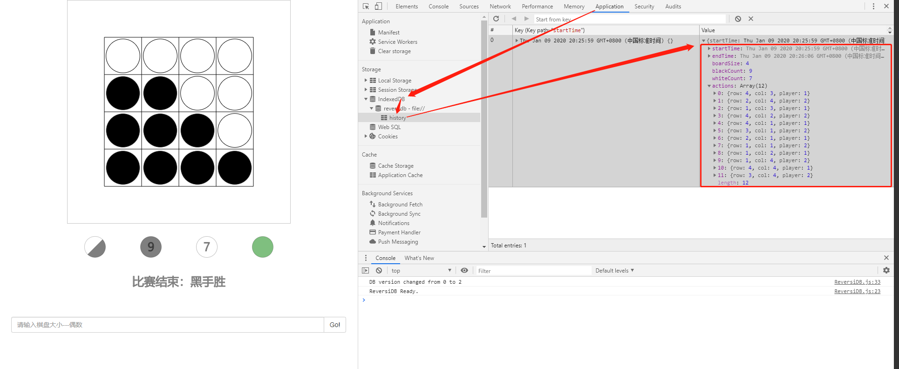

# Reversi 黑白棋游戏
使用 Typescript 编写的带有简单 AI 的黑白棋游戏


*游戏实现了*

1. 基于 HTML Canvas 元素黑白棋的界面（可随意更换大小）
2. 落子规则判断
3. 黑白棋 AI 计算下子策略
4. 四种游戏结束条件正确判断
5. 棋子数目实时显示
6. 多处用到了函数式编程的思想（在代码中有注释）

## 运行
* 下载源代码，在浏览器中打开 `index.html`

## 编译
> Typescript(.ts) 源文件需要编译成 Javascript(.js) 才能在浏览器中运行

1. 安装 [npm](https://www.npmjs.com/) 包管理器
2. 进入项目根目录执行 `npm install` 以安装 Typescript
3. 安装完成后运行 `npm run build` 以启动编译 (或 `./node_modules/.bin/tsc --sourcemap`, 编译选项见 `tsconfig.json`)


## MVC 设计模式
游戏使用 [MVC](https://zh.wikipedia.org/wiki/MVC) (model-view-controller) 的模式组织程序

对应的源码如下

### *Model*
```
src/Model/ReversiGame.ts 游戏规则实现
src/Models/ReversiDB.ts 历史记录存取(并没有存储在csv文件中，而是存在了IndexDB中，F12-Application-Storage-IndexDB-ReversiDB-history 可见)
```



### *View*
实现 UI
```
src/Views/ReversiView.ts 游戏视图
src/Views/MenuView.ts 菜单视图
src/Views/DialogView.ts 对话框视图
```
UI 基于 HTML5 [Canvas](https://zh.wikipedia.org/wiki/Canvas_(HTML%E5%85%83%E7%B4%A0)) 实现。Canvas 是 HTML5 的一个元素，它在页面上嵌入一个画布，并使用 typescript 在上面绘制线条，形状，图像。

### *Controller*
```
src/Controller/ReversiViewController.ts
```
> 这个控制器同时管理了游戏视图和菜单栏视图，两个视图上发生的事件都交给这一个控制器处理

View 接受用户的在 UI 上进行的操作（鼠标点击，鼠标滑动），将动作发送给 Controller，Controller 处理动作。

例如：View 发现用户点击了 Canvas 元素的xx位置，告诉 Controller ，Controller 告诉 Model 玩家在棋盘中xx处落子，Model 处理落子，发现玩家获胜，告诉 Controller 玩家已获胜，Controller 最后控制 View 显示 “已获胜” 的字样。

## AI
游戏自带 AI，能够与玩家进行对战
```
src/AIs/SimpleAI.ts 棋型估分
```

### AI 如何决策
AI 能够看到当前棋盘的棋子分布，就像玩家一样

### AI 如何判断棋局
AI 对不同的棋局进行估分，在不同的位置落子能够产生不同的棋局，选取分数最高的棋局落子。

AI对每个可能的落子位置，都进行尝试，计算该位置的“分值”(可以翻转的对手棋子数量)，分值越高 则在该位置落子越有利。计算每个可能位置的分值，选择最大值位置落子。图7 是计算机持白棋时的分值 情况。注意:行a 列a 的分值是2，因为该位置可以使2 个黑棋翻转。无效的落子位置没有分值。

需要注意的是:可能有2 个或多个棋盘格有相同的分值。这种情况下，选择行字母最小的棋盘格。如果两个棋盘格分值相同且在同一行，则选择列字母较小的棋盘格。按照direction 元组的方向设定，循环计算分值、并测试是否为最高分值，就能确保满足该规则。

## 一些抽象

`src/Controller/` 控制器

`src/Models/` 下存放供 Model 使用的一些数据结构，用于简化 Model 的代码。

`src/Shapes/` 下存放用于在 Canvas 绘制特定形状的类（如：Circle、Rectangle），这些类包装了 Canvas 的 API，防止 View 中出现大量的 Canvas API。

`src/Views/` 下包含了页面信息

`src/Themes/` 下包含了几种棋盘棋子的样式类，用于主题切换

